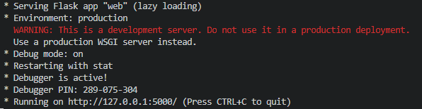
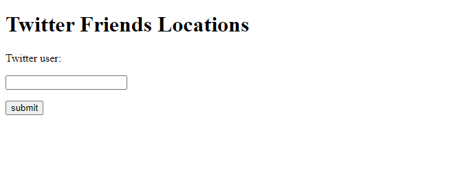
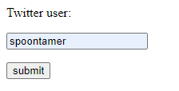
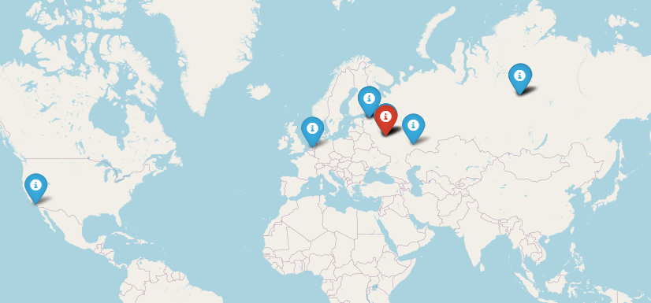
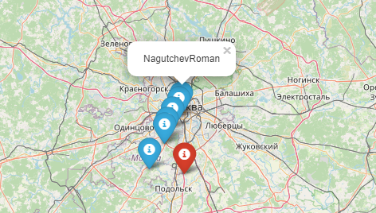

# Task3_Twitter_Friend_Locations

This repository includes 6 python modules:

twurl.py, oauth.py, hidden.py - files which gives an ability to get json files from twitter;

geo.py - module which helps to find location by city/country and creates a map;

twitter.py - module which finds user location, his friends and their locations and includes function main(),
which brings together functions for finding users, their locations and creating the map;

main.py - module which creates web page.

## Installation and usage

Download repository and run module "main.py"

Then you will receive next message and web address:

This webpage includes search form:

Here you can enter the Twitter user's nick:

Submit and if user spesified his location in his account 10 seconds later the map with location of user and his friends(to 20 friends) will authomatically be opened in another tab:

Zoom and if several people have same location you will see them in one city but different places.

## Contributing
Pull requests are welcome. For major changes, please open an issue first to discuss what you would like to change.

## LICENSE
[GNU](https://github.com/hooloobooroodkoo/Film_map/blob/main/LICENSE)
